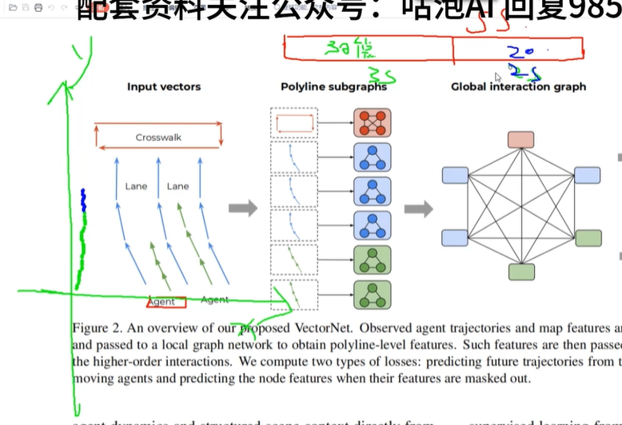
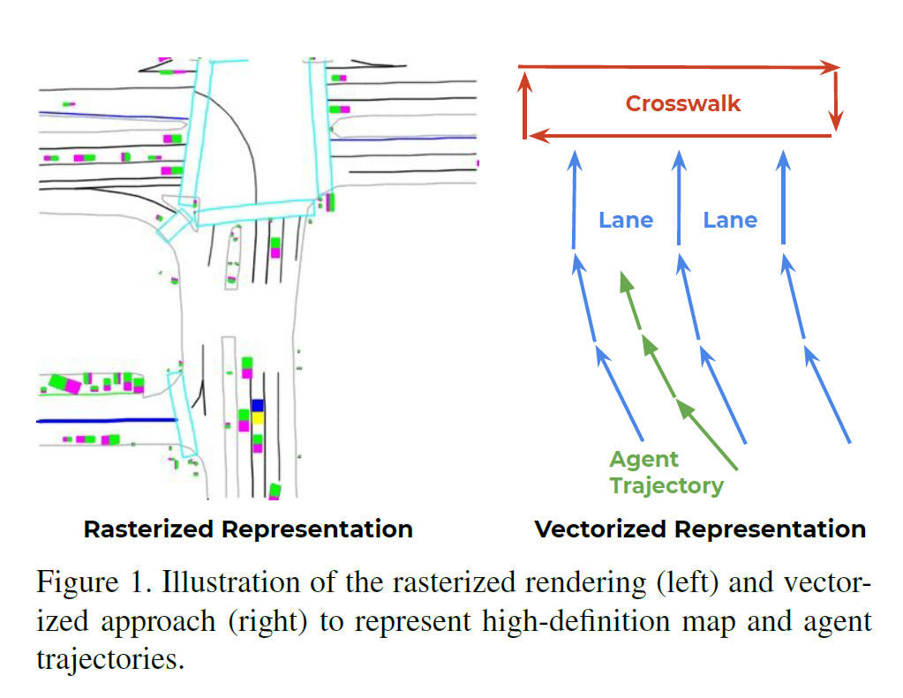
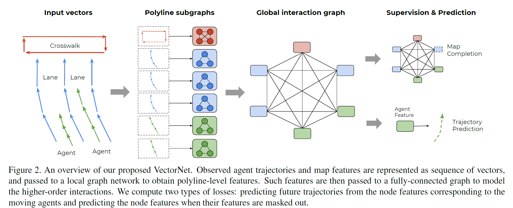
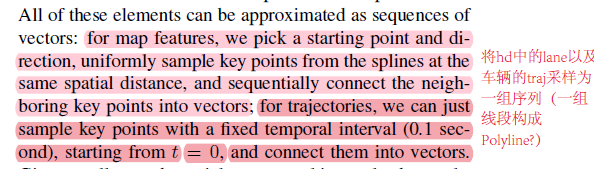
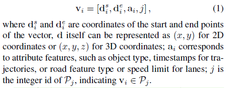
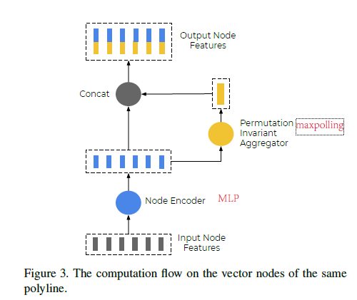
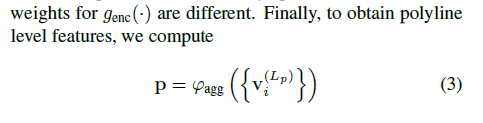
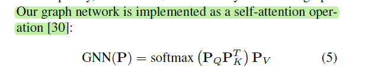
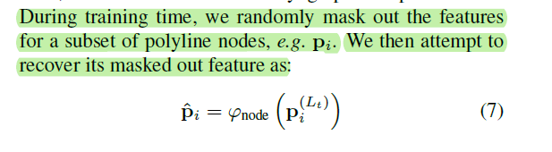

# VectorNet

## 1、Introduction

vectorNet是做Behavior prediction任务的。以argoverse数据集为基准，每个scence约5s，根据前3s车辆的轨迹、以及场景等信息预测后2s的轨迹。

传统的轨迹预测方案，先将道路结构以及其他车辆投影为bev下的rasterized img，再使用CNN进行Embedding；此篇文章直接使用向量化的表征。

使用传统的CNN存在以下几个问题：
- 浅层特征比较局部
- 加深cnn层后，全局信息容易引入干扰成分，关注的FOV可能过大

## 2、Architecture

### 2.1、Polyline subgraphs
将车道线按照距离均匀采样，车辆轨迹按照时间均匀采样，每一个实例构成sequences of vectors（polyline）。

将polyline中的一个vector `!$v_i$`视为subgraph图中的一个node点，node点的feature为：

对同属一polyline的node点构造subgraph，提取特征：

最后，polyline级别的feature，只是计算了一次maxpolling：

## 3、Global interaction graph(Self-Attention)

最后使用MLP预测agent的未来轨迹点，文章也说明MLP可能换成更高阶的decorder。

## 4、代码

民间代码：
- https://github.com/xk-huang/yet-another-vectornet
- https://github.com/DQSSSSS/VectorNet

