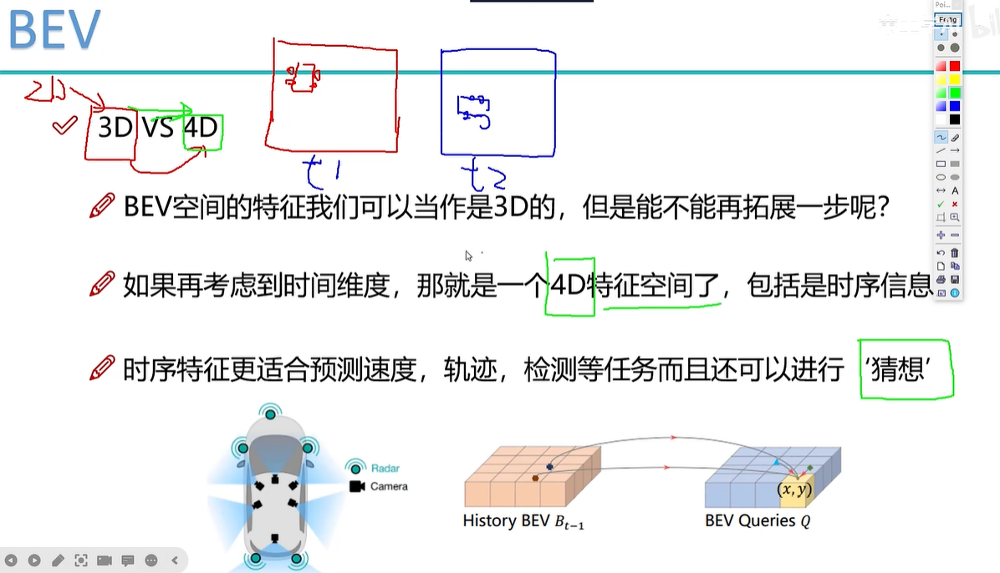
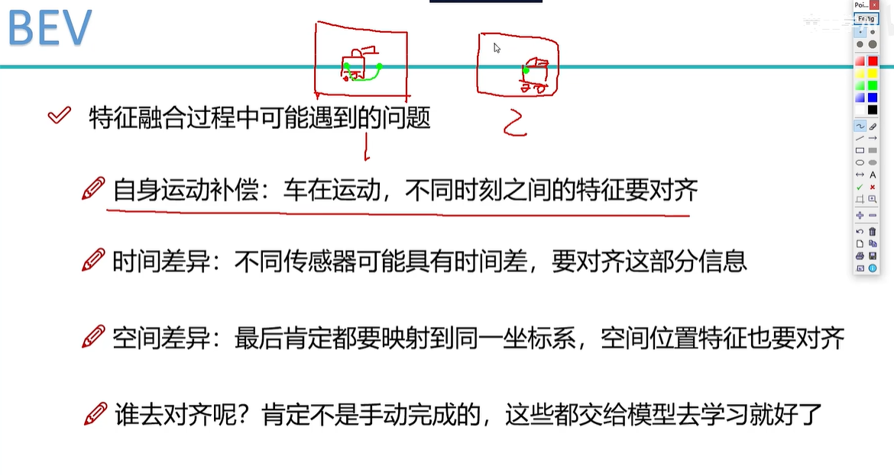
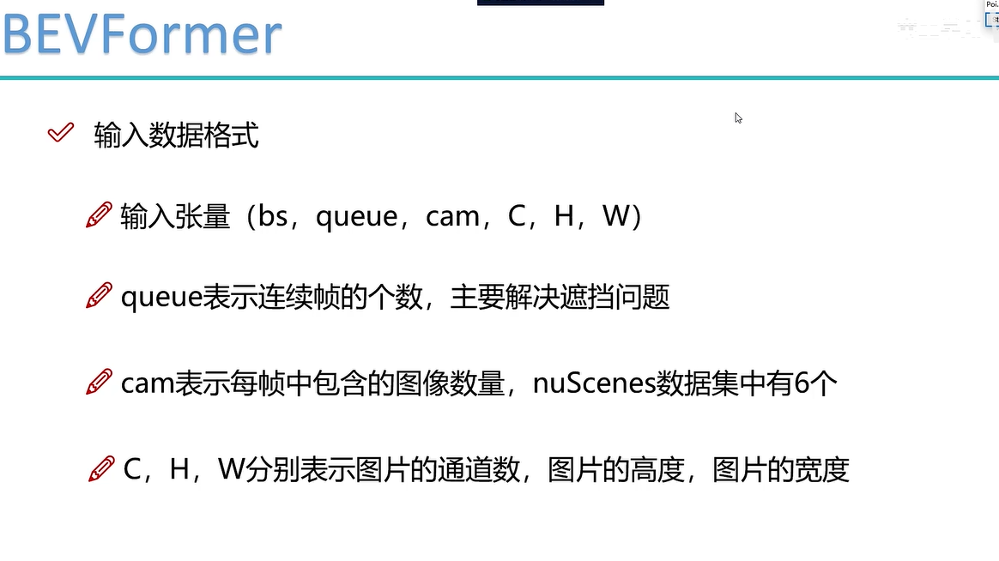
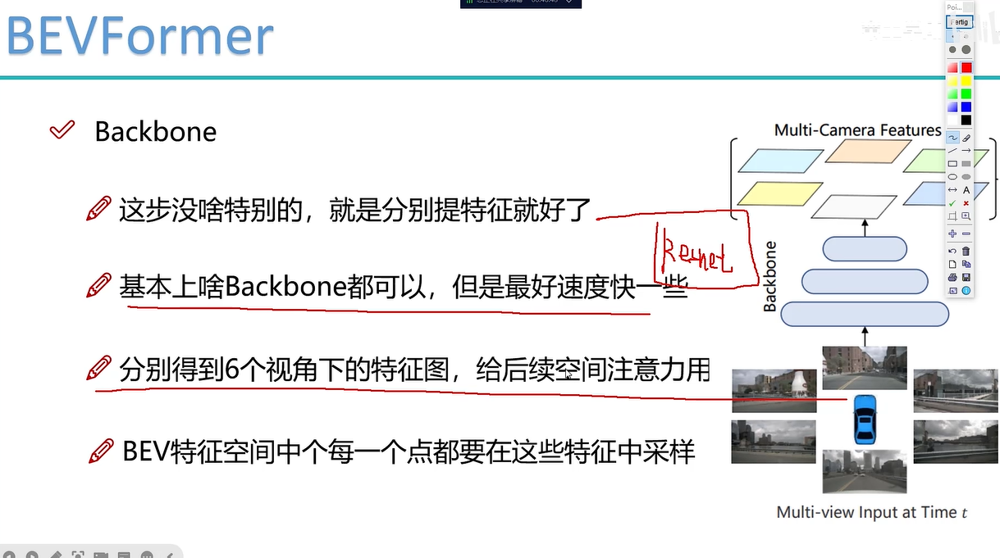
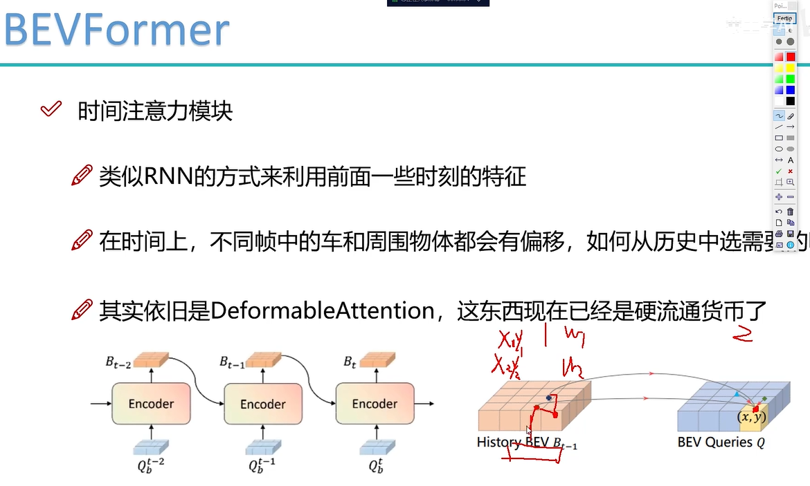
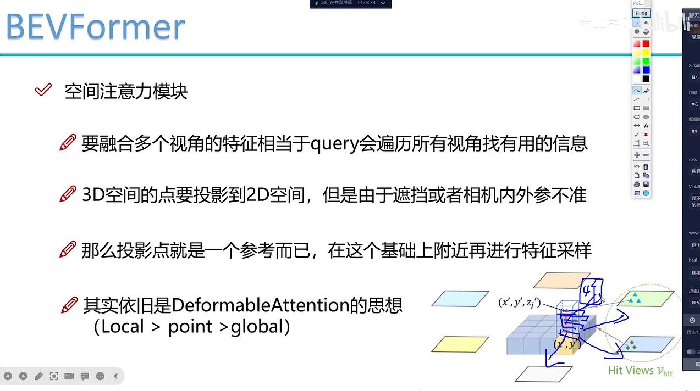
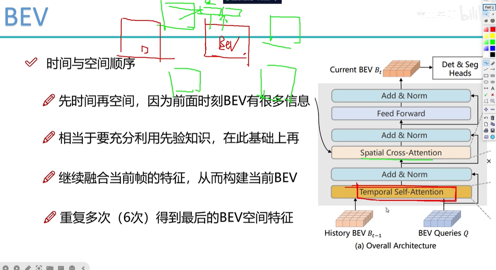
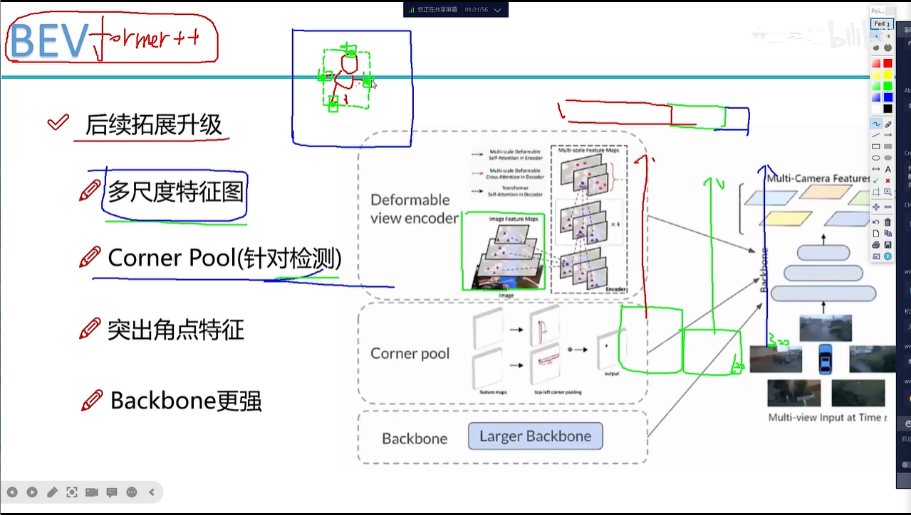
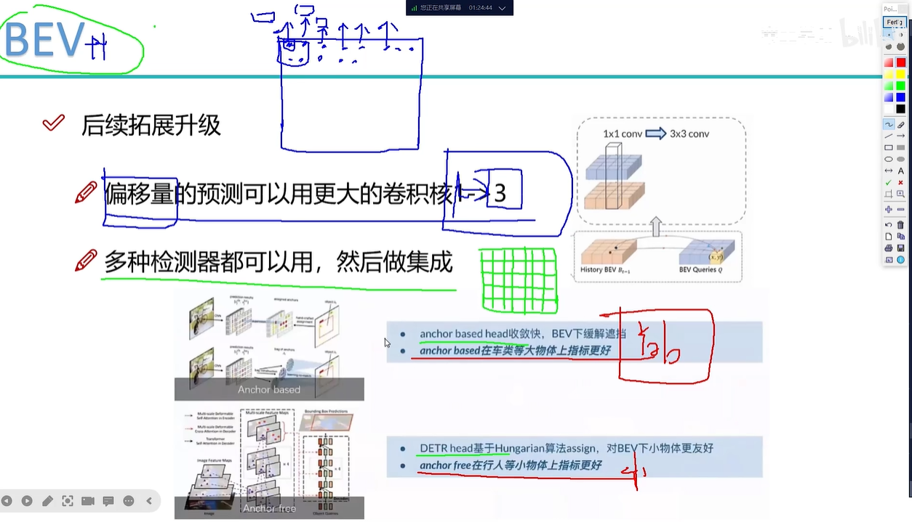

# BevFormer

bevformer是一个基础框架and基础模型，bev空间的感知融合基础框架。

### 1、特征融合中可能遇到的问题

**使用了Deformable Attention**，可学习资料：
- Deformable DETR
- Mask2former
- Bevformer

## 2、Architecture

### 2.1、输入
queue表示时间序列。

### 2.2、Backbone
bevformer做**特征级融合**，第一步从img中提取feature。

### 2.3、时间注意力Temporal Self-Attention
当前t时刻向t-1时刻做query，用网络去做运动补偿（对齐特征），预测（x,y）在t-1时刻的位置偏移量和权重，t-1时刻红色点和黑色点的特征按照权重贡献t时刻的特征。self attention。

### 2.4、空间注意力
在bevformer中每个bev的grid去向img的特征空间去做query（在img特征空间只query局部4个点，deformable的思想）。同时bevformer中引入了“高度”的概念，每个grid对应4个不同的vector去做query，最后再去做一个整合，类似多头注意力机制。cross attention。

## 扩展升级

- corner pool突出角点特征

