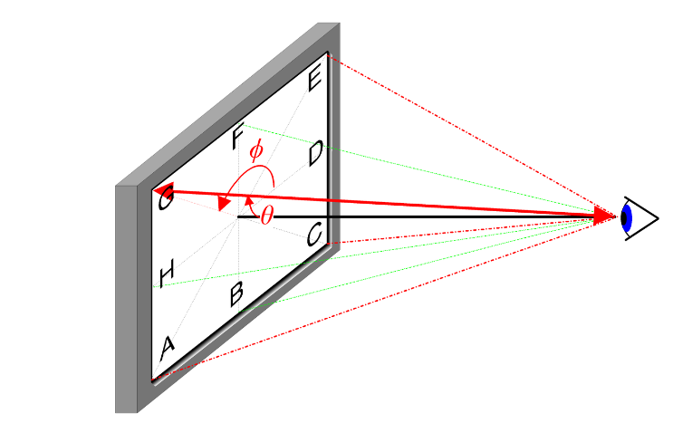
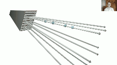

# 1、概述
神经辐射场(Neural Radiance Field，NeRF)是一种具有**隐式场景表达**的新型视场合成技术，NeRF使用多层的MLP表达静态场景，没有显示的三维重建过程，原文章发表在ECCV 2020。


简单理解辐射场的概念，在物理上，光是一种电磁波，不同频率的电磁波作用于相机上便产生了颜色，NeRF中认为辐射场就是对颜色的近似建模。NeRF的创新点：

 - 提出了一种5D神经辐射场来表达复杂的几何+材质的连续场景，该辐射场使用MLP参数化；
 - 提出一种基于经典体素渲染的可微渲染方法，用于从神经辐射场渲染得到RGB图像；
 - 提出一种位置编码(Position Encoding)方法，将每个5D坐标映射到高维空间，如此使得神经辐射场更好地表达高频细节内容；

# 2、场景表达（Neural Radiance Field Scene Representation）
NeRF将一个连续场景表示为5D的向量值函数：

- 这个函数的输入为3D位置`!$ \mathbf{x} =(x,y,z) $`以及2D视角`!$(\theta,\phi)$`
- 输出为发射颜色(emitted color)`!$\mathbf{c}=(r,g,b)$`以及体积密度(volume density)`!$\sigma$`

2D视角可以用下图直观说明：



在实际训练中，NeRF只需要一组图像、对应的位姿以及相机内参，**网络的输入是转换之后的rays**。

图像缺少深度信息，NeRF在near，far（超参数，场景的深度范围）之间采样N_samples+N_imporance个z值（coarse网络和fine网络，Hierarchical volume sampling），将二维像素反投影回world系下作为MLP的3D位置输入。实际实现中，2D视角方向用三维笛卡尔坐标系的单位向量`!$\mathbb{d}$`表征，也就是像素点与相机光心的连线（归一化像平面坐标，再旋转到world系）。使用一个全连接网络MLP来表征这种映射：
```mathjax!
\begin{equation}
F_{\Theta}:(\mathbf{x,d})->(\mathbf{c},\sigma)\label{ref1}
\end{equation}
```
为了让网络学习到多视角表示：

- ==体积密度只与三维位置有关 #F44336==
- 颜色与三维位置和视角都相关

故而==NeRF将一个场景表示为空间中任意点的体积密度和与方向相关的辐射亮度==。体积密度`!$\sigma(\mathbf{x})$`定义为光线停留在位置`!$\mathbf{x}$`处的可导概率（光线穿过此点后终止的概率），一个示意网络结构如下：


# 3、渲染（Volume Rendering with Radiance Fields）
基于经典的体积渲染，NeRF使用`!$F_{\Theta}$`渲染出任意穿过场景的射线的颜色，对于某个视角`!$\mathbf{o}$`发出的方向为`!$\mathbf{d}$`的光线：
```mathjax!
\begin{equation}
\mathbf{r}(t)=\mathbf{o}+t\mathbf{d}\label{ref2}
\end{equation}
```
沿射线方向在范围`!$(t_{n},t_{f})$`内对t积分，获得光线的颜色`!$C(\mathbf{r})$`为:
```mathjax!
\begin{equation}
C(\mathbf{r}) = \int_{t_{n}}^{t_{f}}T(t)\sigma(\mathbf{r}(t))\mathbf{c}(\mathbf{r}(t),\mathbf{d})dt，whereT(t)=exp(-\int_{t_n}^{t}\sigma(\mathbf{r}(s))ds.\label{ref3}
\end{equation}
```
函数`!$T(t)$`表示光线从`!$t_n$`到`!$t$`累积的透明度（transmittance），换句话说就是==光线从`!$t_n$`到`!$t$`没有碰到任何粒子的概率==（这句话对理解代码很有帮助，代码实现与公式不同）。

在实际的渲染中需要进行数值积分求解光线的颜色，采用分层采样（stratified sampling）的方式将`!$[t_{n},t_{f}]$`划分成均匀分布的小区间，对每个小区间（bins）进行均匀采样（实际实现取bins的中点），划分方式如下：
```mathjax!
\begin{equation}
t_i \sim \mathcal{U}\left[ t_{n}+\frac{i-1}{N}(t_{f}-t_{n}),t_{n}+\frac{i}{N}(t_{f}-t_{n})\right]\label{ref4}
\end{equation}
```
离散后的颜色积分函数为：
```mathjax!
\begin{equation}
\hat{C}(\mathbf{r})=\sum_{i=1}^N T_i\left(1-\exp \left(-\sigma_i \delta_i\right)\right) \mathbf{c}_i, \text { where } T_i=\exp \left(-\sum_{j=1}^{i-1} \sigma_j \delta_j\right)\label{ref5}
\end{equation}
```
其中`!$\delta_{i}=t_{i+1}-t_{i}$`为两次采样间的距离。


# 4、Trick
上述是NeRF的主要思想，但基于此并不能到达SOTA的结果，例如细节不够精细，训练较慢等问题，为此NeRF引入了如下两个策略：

- Positional Encoding（位置编码）：使得MLP能更好的表示高频信息，从而得到更精细的细节；
- Hierarchical Sampling Procedure（金字塔采用方案）：使得训练过程更高效地捕捉细节，采用高频信息；

## 4.1、位置编码（Positional Encoding） 

神经网络理论上可以逼近任何函数。但是神经网络倾向于学习低频率的函数，将输入通过高频函数映射到高维空间，可以更好地拟合数据中的高频信息（《On the spectral bias of neural networks. In: ICML (2018) 》）。

NeRF中使用的高频编码函数如下：
```mathjax!
\begin{equation}
\gamma(p)=\left(\sin \left(2^0 \pi p\right), \cos \left(2^0 \pi p\right), \cdots, \sin \left(2^{L-1} \pi p\right), \cos \left(2^{L-1} \pi p\right)\right)\label{ref6}
\end{equation}
```
该函数会应用于3D位置`!$ \mathbf{x} $`以及笛卡尔系下归一化的视角方向`!$\mathbf{d}$`。本文对于`!$\gamma(\mathbf{x})$`取`!$L=10$`，对于`!$\gamma(\mathbf{d})$`取`!$L=4$`，因此三维位置坐标的编码向量长度为`!$3\times2\times10=60$`，三维视角方向的编码向量长度为`!$3\times2\times4=24$`，与上述网络结构图的输入维度一致。

==实际代码中高频编码函数`!$sin,cos$`中没有乘pi #E91E63==，并且会把原始的3D位置和视角方向编码进去（输入向量增加到63与27维）。

## 4.2、分层采样方案（Hierarchical Sampling Procedure）
分层采样方案来自于经典渲染算法的加速工作，在前述的体素渲染 (Volume Rendering) 方法中，对于射线上的点如何采样会影响最终的效率，采样点过多计算效率太低，采样点过少又不能很好地近似。
那么一个很自然的想法就是希望对于颜色贡献大的点附近密集采样，贡献小的点附近稀疏采样，这样就可以解决问题。基于这一想法，NeRF 很自然地提出由粗到细的分层采样方案（Coarse to Fine）。

**Coarse部分：**


对于粗网络在near，far之间均匀采样N_samples个稀疏点，将公式（5）写为“权重形式”：
```mathjax!
\begin{equation}
\hat{C}_c(\mathbf{r})=\sum_{i=1}^{N_c} w_i c_i, \quad w_i=T_i\left(1-\exp \left(-\sigma_i \delta_i\right)\right)\label{ref7}
\end{equation}
```
权重需要进行归一化处理：
```mathjax!
\begin{equation}
\hat{w}_i=\frac{w_i}{\sum_{j=1}^{N_c} w_j}\label{ref8}
\end{equation}
```
权重`!$\hat{w}_i$`可以看为沿着射线的概率密度函数（PDF），这个概率密度函数可以粗略得到射线上颜色的分布情况。

**Fine部分：**


在Fine部分，根据Coarse部分权重的pdf函数，使用逆变换采样（Inverse Transform Sampling），采样出N_imporance个点。最终将全部N_samples+N_imporance个样本带入公式（5）计算本条射线的颜色`!$\hat{C}(\mathbf{r})$`。

如图所示，白色点为Coarse阶段的均匀采样点，通过Coarse阶段得到的PDF，Fine阶段根据分布对橘黄色点进行采样，概率高的地方采样密集，概率低的地方稀疏采样，如此实现在真正有场景内容的地方采样更多点，实现了重要性抽样（Importance Sampling）。

逆变换采样：


在y轴[0,1]区间均匀采样，x轴的样本点符合概率密度分布。

# 5、损失函数
NeRF对coarse以及fine网络都采取`!$L_2$`Loss，公式如下：
```mathjax!
\begin{equation}
\mathcal{L}=\sum_{\mathbf{r} \in \mathcal{R}}\left[\left\|\hat{C}_c(\mathbf{r})-C(\mathbf{r})\right\|_2^2+\left\|\hat{C}_f(\mathbf{r})-C(\mathbf{r})\right\|_2^2\right]\label{ref9}
\end{equation}
```

- `!$ \mathcal{R}$`表示一个batch中的射线集合
- `!$C(\mathbf{r})$`表示RGB颜色真值
- `!$\hat{C}_c(\mathbf{r})$`表示coarse网络预测的RGB颜色
- `!$\hat{C}_f(\mathbf{r})$`表示fine网络预测的RGB颜色

# 6、参考

- https://arxiv.org/abs/2003.08934
- http://www.liuxiao.org/2021/11/%E8%AE%BA%E6%96%87%E7%AC%94%E8%AE%B0%EF%BC%9Anerf-representing-scenes-as-neural-radiance-fields-for-view-synthesis/