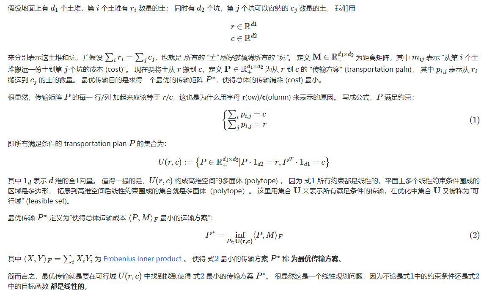
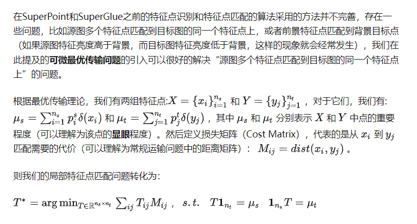

# 最优传输算法（Optimal Transport）

最优传输算法（Optimal Transport，OT）是一种求解两个概率分布之间最小距离的优化算法。最优传输算法的核心思想是将一个概率分布转化为另一个概率分布，使得转化后的分布与目标分布之间的距离最小。这个距离通常采用Wasserstein距离，也被称为Earth Mover's Distance（EMD），它是一个基于流形的距离度量，可以衡量两个概率分布之间的差异。

最优传输算法的求解过程可以分为两步。首先，需要构造一个转移矩阵，描述如何将源分布中的质量转移到目标分布中。其次，需要求解一个最小化目标函数的优化问题，该目标函数定义了源分布和目标分布之间的距离度量。

https://kaizhao.net/blog/optimal-transport

## 1、特征点匹配与最优传输的关联

## 2、Optimal matching layer

特征匹配必须满足的硬性要求：
- src特征点至多有一个ref匹配点；
- 某些src特征点由于遮挡等原因没有ref匹配点；

**一个优秀的匹配模型，应该既能找到特征的正确匹配关系，又可以鉴别错误匹配。**

## 2.1、
https://blog.csdn.net/shizhuoduao/article/details/107120805

https://vincentqin.gitee.io/posts/superglue/#comments